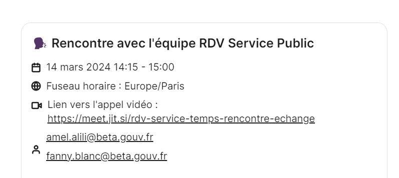

# Revue d’avancement du jeudi \(Stand-up\)

L’incubateur, en tant qu’organisation, est un produit vivant construit par ses membres. La revue de portefeuille, dit « le stand-up », est le rassemblement hebdomadaire de la communauté pour partager avec ses pairs sur les avancées de chaque équipe, leur impact, aussi bien que sur les aspects transverses et stratégiques du collectif.

Les personnes extérieures qui souhaitent nous découvrir sont les bienvenues, à l'invitation d'une équipe ou du collectif.

### Horaire et lieu

Tous les mercredis à 12h dans l’open space à Ségur, pour une durée variable selon le nombre de produits et de sujets transverses.

> À titre indicatif, la durée est généralement comprise entre 25 et 40 minutes.

### Pourquoi

Partager les avancées hebdomadaires et les blocages de chaque service et de l'incubateur, de manière à éviter les silos et à rester focalisés sur l’usager.

_Note : le stand-up n’est pas une instance de contrôle où vous faites du reporting à votre hiérarchie. Nous considérons en effet que les principaux pilotes des services développés dans le cadre du programme beta.gouv.fr sont les utilisateurs._

### Stand-up « Comment »

#### Avant

* Pensez à préparer votre présentation et vos sujets à l'avance, qu'y a-t-il d'intéressant pour les autres \(accomplissements\) ? pour vous \(blocages\) ? sur quoi avez vous besoin d'aide ?
* Vous n’êtes pas là ? Faites passer votre message sur l'outil de messagerie instantanée Slack \(avant 11h50 !\) ;
* Invitez les nouvelles et les nouveaux de votre équipe à se présenter.

#### Pendant

* Lancer sur un écran visible le [logiciel de stand-up](http://stand-up.surge.sh/) \([code disponible sur GitHub](https://github.com/sgmap/standup/)\) ;
* Nouvelles, nouveaux, visiteuses, visiteurs : **présentez-vous** :\)
* Équipes : c’est au maximum **1min** par **service**, dont **5-10s** pour le _présenter brièvement_ : Évitez les **acronymes**. Si vous ne pouvez pas, traduisez-les. Si vous n’avez rien à dire, dites-le et passer votre tour. **Évitez le dialogue** pendant le stand-up ;
* Annonces transverses : c’est au maximum **5min**, tout le monde compris.

#### Après

* **Remerciez** les participants ;
* **Dialoguez**, si vous voulez, avec qui vous voulez, comme vous voulez ;
* Va-t-on **déjeuner** ?

### Rôles nécessaires

* **Facilitation** : animer le stand-up, en rappeler les règles et les faire respecter ;
* **Gestion du temps** : gérer le chronomètre, s'assurer qu'il est visible par l'ensemble des participant·e·s.

### Amélioration continue

Tout ce qui est décrit ci-dessus peut être modifié en \[\[séminaire\]\].

