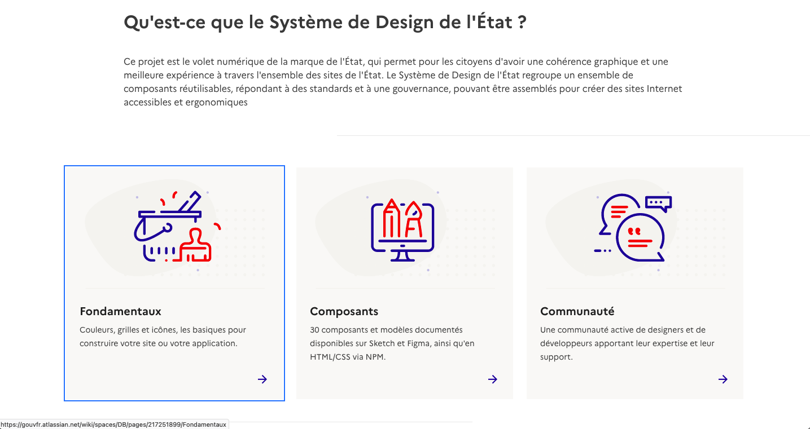
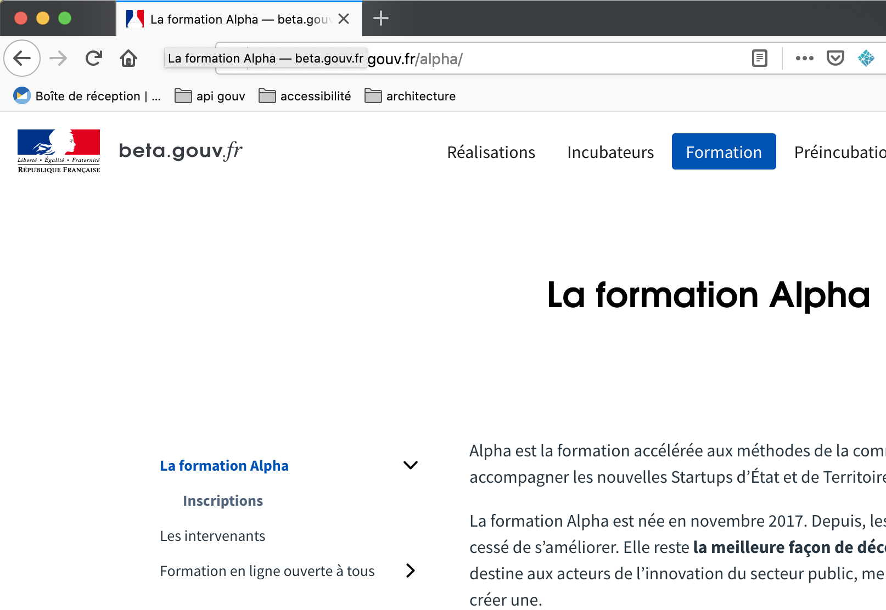
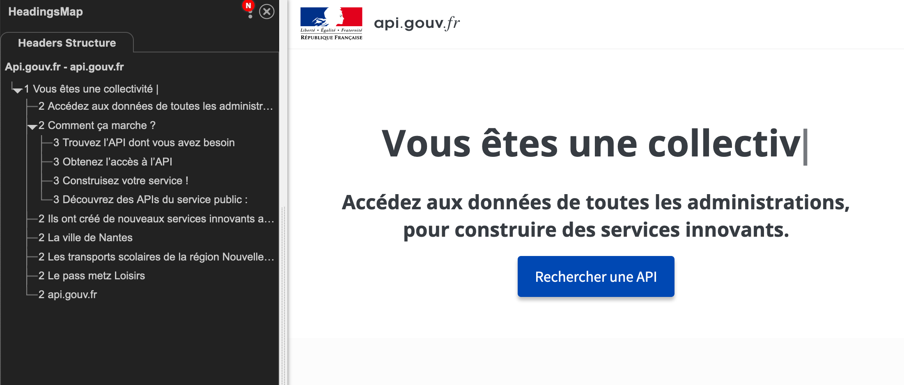

# Kit accessibilité - Construction

## Identifier les rôles de chacun

Chaque membre de l'équipe peut mettre ses compétences à disposition pour améliorer l'accessibilité du service.



Les designers ont la responsabilité de concevoir un service accessible, qu'il s'agisse de wireframes, prototypes ou maquettes.

Le site [Design Accessible](https://design-accessible.fr) propose une checklist : navigation, couleurs, formulaires...



Les développeurs et développeuses ont la responsabilité de coder des composants accessibles. De nombreux outils peuvent aider :

* La [Notice d’accessibilité HTML et CSS](https://www.accede-web.com/notices/html-et-css/) d'AccedeWeb liste les règles à respecter pour un site accessible (structure générale, titre, liens, boutons, formulaires, liste...)
* La [Notice d’accessibilité des principaux composants d’interface riche](https://www.accede-web.com/notices/interface-riche/) présente les principaux motifs de conception qu’il est recommandé de respecter lors du développement des composants d’interface riches (accordéons, modales, menu déroulant....)
* Le [Design System de l'État](https://gouvfr.atlassian.net/wiki/spaces/DB/overview?homepageId=145359476) propose une documentation et des composants nativement accessible.



De nombreuses personnes peuvent être amenés à rédiger du contenu, au sein du service d'une SE. La [Notice d’accessibilité éditoriale ](https://www.accede-web.com/notices/editoriale-modele/)d'AccedeWeb donne des règles à respecter pour créer du contenu accessible en ligne.



## Partir sur de bonnes bases

L'accessibilité du service peut être pensée dès les premières phases de construction (prototypes, développements...).

Il existe quelques bonnes pratiques facile à vérifier, pour lever les obstacles les plus évidents. Ces vérifications ne demandent aucune connaissances techniques : n'importe qui peut s'en assurer !


Contacter l'équipe Designers Transverse pour organiser un atelier **« Vérifier l'accessibilité de mon service »**


### 10 choses faciles à vérifier



**Il y a au moins deux façons de naviguer dans le site.** Cela peut être un menu mais aussi un moteur de recherche, un plan, un fil d'ariane...

**Il est possible de naviguer au clavier**

Si la navigation au clavier est possible, les personnes utilisant des technologies d'assistances comme un lecteur d'écran pourront aussi utiliser votre service.

* Toutes les sections du site et toutes les actions sont possibles grâce au clavier (`tab` pour naviguer d'une zone à un autre, `shift + tab` pour revenir en arrière et `Entrer` pour actionner un lien).&#x20;
* Un effet focus permet de repérer facilement la zone sélectionnée.&#x20;
* Il est toujours possible de sortir d'une zone au clavier.




**Les titres des pages ont du sens**

La balise titre est la première chose lue par un lecteur d'écran : elle doit donc permettre à l'utilisateur de se repérer facilement :

* Elle décrit le contenu de la page brièvement.
* Plusieurs pages du même site peuvent être différenciées facilement.

**Les titres respectent un ordre hiérarchique**

Les titres de la page sont cohérents : il n'y a pas de trous dans les niveaux (de h1 à h6).


Je vérifie avec l'extension [HeadingsMap pour Firefox](https://addons.mozilla.org/fr/firefox/addon/headingsmap/)


**La taille des textes peut être agrandie**

Certains utilisateurs agrandissent le texte de la page pour mieux pouvoir le lire. Si j'utilise les options de zoom de texte du navigateur, le site doit rester lisible, les différentes informations ne doivent pas se superposer.




**Le sens n'est jamais véhiculé uniquement par un code graphique**

Beaucoup d'utilisateur ont des difficultés à percevoir les couleur ou à comprendre certains pictogrammes. On peut doubler les éléments signifiants en ajoutant un texte à l'icône par exemple.

**Tous les éléments graphiques signifiants ont une alternative textuelle**

Si un élément graphique est purement décoratif, le lecteur d'écran ne doit pas recevoir d'information : il convient de laisser l'image sans alternative.\
Lorsqu'un élément graphique porte un sens, il faut lui donner une alternative textuelle.


Les tests automatiques afficheront une erreur si vous ne décrivez pas une image. Ne vous fiez pas toujours à ces tests : vous seuls savez si l'image porte un sens ou non.




**Le formulaire est accessible du début à la fin.**

Les champs obligatoires sont clairement identifiés.

L'autocomplétion n'est pas bloquante.

Il n'y a pas de capcha ou d'élément graphique infranchissable pour valider le formulaire.



**Les contrastes sont suffisants.**

Le ratio de contraste entre la couleur de fond et la couleur du texte est supérieur à 4,5.

Les niveaux de contrastes peuvent être testés grâce l'onglet "accessibilité" de l'inspecteur de votre navigateur.


Pour trouver les couleurs accessibles les plus proches de votre charte graphique, vous pouvez utiliser les suggestions de [Contrast Finder](https://contrast-finder.tanaguru.com/?lang=fr), de Tanaguru


**Le site reste lisible et compréhensible lorsque la feuille de style css est désactivée**

Dans votre navigateur, vous pouvez désactiver la feuille de style appliquée à votre service : le site reste-t-il lisible ?



### Pour aller plus loin

* Demander une formation [10 choses faciles à vérifier](https://doc.incubateur.net/design/nos-rendez-vous-design/formation/accessibilite) pour mon équipe
* Utiliser [les ressources et outils Accessibilité de la DILA](https://pidila.gitlab.io).
* Utiliser des outils dédiés :&#x20;



Ces outils peuvent s'installer d'un simple `drag 'n drop` vers la barre des signets de votre navigateur. Ils sont donc compatibles tout navigateurs :

* [**ANDI**](https://www.ssa.gov/accessibility/andi/help/install.html) : détecte automatiquement plusieurs types de problèmes d'accessibilités et donne des conseils pratiques pour les corriger.



* [**Assistant RGAA**](https://chrome.google.com/webstore/detail/assistant-rgaa/cgpmofepeeiaaljkcclfldhaalfpcand?hl=fr) **:** extension de navigateur pour auditer des pages web en suivant le référentiel RGAA (attention, il s'agit du RGAA 3.0)
* [**WAVE**](https://wave.webaim.org/extension/) **:** détecte automatiquement plusieurs types de problèmes d'accessibilités et donne des conseils pratiques pour les corriger.



* [**WAVE**](https://wave.webaim.org/extension/) **:** détecte automatiquement plusieurs types de problèmes d'accessibilités et donne des conseils pratiques pour les corriger.
* [WCAG Constrast Checker](https://addons.mozilla.org/en-US/firefox/addon/wcag-contrast-checker/) : vérifie les contrates sur la page&#x20;



* [**WAVE**](https://wave.webaim.org) **:** détecte automatiquement plusieurs types de problèmes d'accessibilités et donne des conseils pratiques pour les corriger.



### Checklist de la phase Construction

* [ ] J'identifie ce que je peux faire à mon niveau, et comment mon équipe peut se répartir les responsabilités.&#x20;
* [ ] Je m'assure que les règles élémentaires de l’accessibilité sont respectées.
