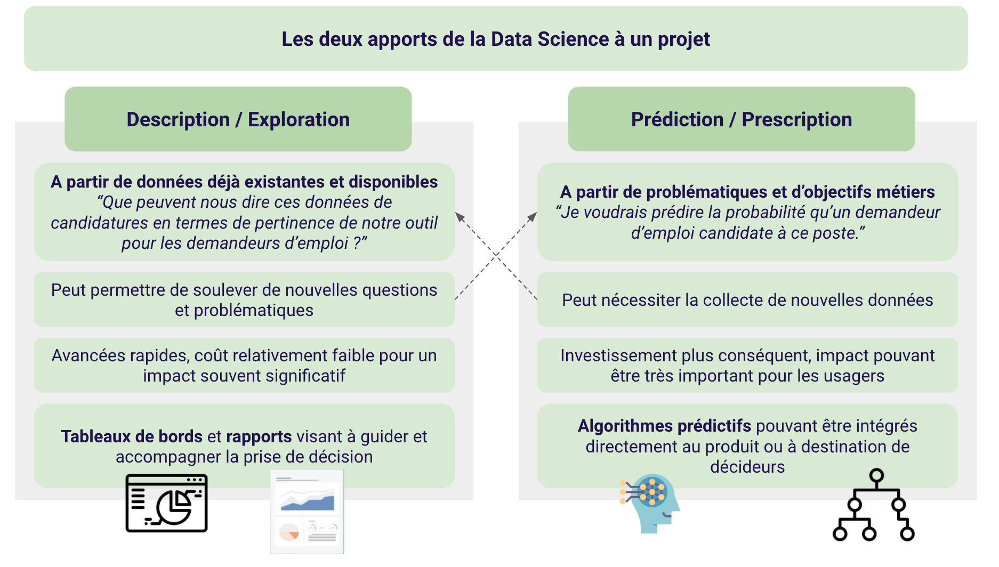

# Data Science

## Quésaco ?

La _data science_, ou science des données, est un domaine interdisciplinaire qui utilise des méthodes, des processus, des algorithmes et des systèmes scientifiques pour extraire des connaissances et des idées de nombreuses données structurelles et non structurées.

## Deux approches complémentaires en Data Science

## Offre de service

L’offre de data science pour une SE peut se résumer à l’accompagner pour définir, implémenter , mesurer et améliorer/corriger des cas d'usage data \(modèles prédictifs, machine learning, segmentation de la donnée, exploration de nouvelles données, tableaux de bords, etc.\)

## Quelle est type de SE est concerné par la Data Science ?

Toute SE génère nécessairement des données diverses et variées : données d'usage de l'outil, d'utilisateurs, issues d'autres administrations ou bien de partenaires externes, données ouvertes collectées sur le web...

En général, il est préférable d'avoir des questions précises auxquelles on souhaite répondre ou, à défaut, des données précises que l'on souhaite valoriser.

Une SE plus mature sur les questions de data science se concentrera plutôt sur la mise en production et l'amélioration continue de ses cas d'usage, par exemple via le [MLOps](https://ml-ops.org/).

## Qui propose de l'aide ?

* [**Vincent Viers**](https://www.linkedin.com/in/vincent-viers/), Data Scientist transverse @beta.gouv

## Le format

* Interventions ponctuelles auprès de startups \(jusqu'à 1 ou 2 jours par semaine sur quelques mois\).
* Ateliers collectifs, animation de la communauté data -&gt; :construction-worker:
* Aide au recrutement d'un profil data \(data scientist, data engineer, data analyst\).

## Comment demander de l'aide en data science ?

Sur Mattermost, ou par mail : **vincent.viers@beta.gouv.fr**

